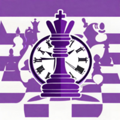

# chessClock

Chess Clock es una app simple de reloj de ajedrez desarrollada en Unity con c#.

Características:

Temporizadores personalizables (1, 5, 10 y 20 minutos).
Control de tiempo facil: Pausa el temporizador de un jugador y activa el del oponente.
images/bannerChessClock.jpg

 

Link a playstore: https://play.google.com/store/apps/details?id=com.mantisnet.chessclock

