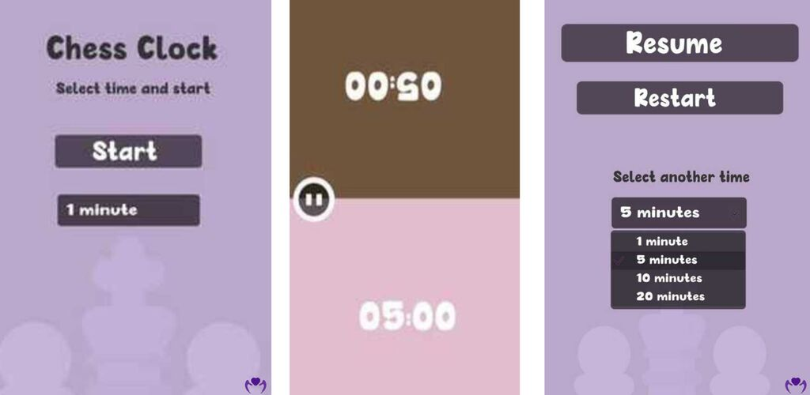

# Chess Clock

Chess Clock es una app simple de reloj de ajedrez desarrollada en Unity con C#.

## Características:
- Temporizadores personalizables (1, 5, 10 y 20 minutos).
- Control de tiempo fácil: pausa el temporizador de un jugador y activa el del oponente.

 

## Enlace a Play Store:
[Descargar Chess Clock](https://play.google.com/store/apps/details?id=com.mantisnet.chessclock)
